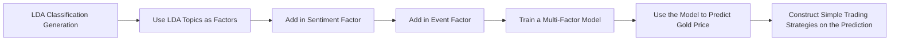

## AstroNLP: Blog-Post-3

In the third blog, which is very likely to be the final one, we will introduce the details about how we derive trading signals from news headlines and then implement trading strategies according to the signals. Here in the post, we will mainly focus on the procedure, while some specific results are to be mentioned in the report, making sure that two contents do not overlap a lot. Also, this blog is aimed for better understanding our code, which will not be illustrated detailly in the report due to the space limit.

Our overall idea is to construct a multi-factor gold price prediction model based on NLP. The entire process briefly follows:



---

### 1. LDA Topic Modeling

In this section, we are going to classify the news headlines using the LDA method. After cleaning the text data, we use CountVectorizer for text vectorization as LDA typically uses term frequency matrix:

```python
vectorizer = CountVectorizer(
    max_features=1000,      # Keep top 1000 most common words
    min_df=5,               # Appear in at least 5 documents
    max_df=0.7,             # Appear in at most 70% of documents (filter high-frequency words)
    ngram_range=(1, 2)      # Consider unigrams and bigrams
)

# Transform to term frequency matrix
X = vectorizer.fit_transform(df['clean_title'])
feature_names = vectorizer.get_feature_names_out()
```

As can be seen above, when we instantiate the ```vectorizer``` , we only keep the high-frequency words.

Then we can set out training our LDA model:

```python
n_topics = 6
topic_labels = [
    'LDA1',      
    'LDA2',    
    'LDA3',        
    'LDA4',        
    'LDA5',   
    'LDA6'     
]

# Train LDA model
lda_model = LatentDirichletAllocation(
    n_components=n_topics,
    max_iter=50,              # Number of iterations
    learning_method='batch',  # Batch learning (suitable for small datasets)
    random_state=42,
    n_jobs=-1                 
)

print(f"Training LDA model (topics={n_topics})...")
lda_model.fit(X)
print("Training completed!")
```

We can try to investigate what the keywords are inside the topics:

```python
def display_topics(model, feature_names, n_top_words=10):
    """Display top keywords for each topic"""
    topics = []
    for topic_idx, topic in enumerate(model.components_):
        top_indices = topic.argsort()[-n_top_words:][::-1]
        top_words = [feature_names[i] for i in top_indices]
        topics.append(top_words)
        print(f"\nTopic {topic_idx} ({topic_labels[topic_idx]}):")
        print(f"  Keywords: {', '.join(top_words)}")
    return topics

topics_keywords = display_topics(lda_model, feature_names, n_top_words=20)
```

```
Topic 0 (LDA1):
  Keywords: at, oz, at oz, or, to, dec, dec gold, falls, up, down, gold falls, or to, settle, settle at, to settle, to oz, june, up or, gold down, down or

Topic 1 (LDA2):
  Keywords: for, the, of, futures, gold futures, week, in, for the, fed, since, session, ahead, gain, ahead of, lower, but, at, end, more, the week

Topic 2 (LDA3):
  Keywords: futures, gold futures, after, to, rs, in, trade, on, at, to rs, global, cues, global cues, trading, rise, per, at rs, rs per, data, up

Topic 3 (LDA4):
  Keywords: as, prices, gold prices, in, dollar, on, us, gains, to, as dollar, data, asia, higher, demand, in asia, stocks, india, lower, gold gains, investors

Topic 4 (LDA5):
  Keywords: ounce, an, an ounce, at, ends, up, gold ends, at an, down, on, futures, gold futures, in, up at, to, higher, first, gold up, lower, to an

Topic 5 (LDA6):
  Keywords: on, silver, to, rs, high, gold silver, global, demand, low, by, mcx, cues, up, month, global cues, weak, near, contract, of, week
```

It seems that the first topic LDA1 is related to the downtrend of gold price, and the second topic LDA2 is related to the future of gold price. Can we say so? Obviously no! Because LDA is a kind of unsupervised learning, we do not know what its outcomes actually stand for naturally, and that's why we need to further construct multi-factor model for prediction. 

Now we generate the topic distribution for each news headlines respectively to see which topic it is most likely to belong to and derive the LDA feature for the news headlines:

```python
topic_distributions = lda_model.transform(X)

print(f"Topic distribution matrix shape: {topic_distributions.shape}")
print(f"Each row represents a news article with {n_topics} topic probabilities (sum to 1)")

# Add topic probabilities to DataFrame
for i, label in enumerate(topic_labels):
    df[f'topic_{label}'] = topic_distributions[:, i]

# Add dominant topic (topic with highest probability)
df['dominant_topic'] = topic_distributions.argmax(axis=1)
df['dominant_topic_name'] = df['dominant_topic'].map(lambda x: topic_labels[x])
df['dominant_topic_prob'] = topic_distributions.max(axis=1)
```

### 2. Add in More Factors

In this section, we will add in more factors, besides our LDA feature, to construct a multi-factor model.

#### - Category A Factors: Media Sentiment and Attention

The sentiment score has been included in the original dataset on Hugging Face, so we can directly compute the statistics of it:

```python
daily_sentiment = df_text.groupby('news_date').agg({
    'sentiment': ['mean', 'std', 'min', 'max', 'count']
}).reset_index()

# Flatten multi-level column names
daily_sentiment.columns = ['date', 'sentiment_mean', 'sentiment_std', 
                           'sentiment_min', 'sentiment_max', 'sentiment_count']

# Calculate moving averages
daily_sentiment = daily_sentiment.sort_values('date')
daily_sentiment['sentiment_ma5'] = daily_sentiment['sentiment_mean'].rolling(window=5, min_periods=1).mean()
daily_sentiment['sentiment_ma20'] = daily_sentiment['sentiment_mean'].rolling(window=20, min_periods=1).mean()

# Calculate sentiment trend (current sentiment - 20-day average)
daily_sentiment['sentiment_trend'] = daily_sentiment['sentiment_mean'] - daily_sentiment['sentiment_ma20']
```

Then is the attention factor. We define it as the daily news volume and its following statistics:

```python
daily_news_count = df_news.groupby('news_date').size().reset_index(name='news_count')
daily_news_count.columns = ['date', 'news_count']

# Calculate moving average of news count (smooth attention level)
daily_news_count = daily_news_count.sort_values('date')
daily_news_count['news_count_ma5'] = daily_news_count['news_count'].rolling(window=5, min_periods=1).mean()
daily_news_count['news_count_ma20'] = daily_news_count['news_count'].rolling(window=20, min_periods=1).mean()

# Calculate attention anomaly indicator (current count / 20-day average)
daily_news_count['news_attention_ratio'] = daily_news_count['news_count'] / daily_news_count['news_count_ma20']
```

#### - Category B Factors: Event-Driven

We mainly consider 2 events for this category: the Fed and Geopolitical events. Here we use NLP again:

```python
fomc_keywords = r'(?i)(FOMC|Fed meeting|Federal Reserve meeting|Fed minutes|FOMC statement|Fed policy)'

# Search keywords in news titles
df_news['is_fomc'] = df_news['news_title'].str.contains(fomc_keywords, regex=True, na=False).astype(int)

# Aggregate by date
daily_fomc = df_news.groupby('news_date').agg({
    'is_fomc': ['sum', 'max']
}).reset_index()
daily_fomc.columns = ['date', 'fomc_news_count', 'has_fomc_event']

print("=" * 60)
print("C1. FOMC Event Marker")
print("=" * 60)
print(f"✓ Generated factors: fomc_news_count (daily FOMC news count), has_fomc_event (0/1 flag)")
print(f"✓ FOMC event days identified: {daily_fomc['has_fomc_event'].sum()}")
print(f"✓ Total FOMC news: {daily_fomc['fomc_news_count'].sum()}")

# Display FOMC event date examples
fomc_dates = daily_fomc[daily_fomc['has_fomc_event'] == 1].sort_values('date')
```

We mark the news headlines that contain specific keywords, so as for the geopolitical events:

```python
geopolitical_keywords = r'(?i)(war|conflict|Ukraine|Russia|North Korea|Iran|Syria|Yemen|tariff|trade war|sanction|Brexit|tension|crisis)'

# Search keywords in news titles
df_news['is_geopolitical'] = df_news['news_title'].str.contains(geopolitical_keywords, regex=True, na=False).astype(int)

# Aggregate by date
daily_geopolitical = df_news.groupby('news_date').agg({
    'is_geopolitical': 'sum'
}).reset_index()
daily_geopolitical.columns = ['date', 'geopolitical_risk_count']

# Calculate moving average (smooth risk index)
daily_geopolitical = daily_geopolitical.sort_values('date')
daily_geopolitical['geopolitical_risk_ma5'] = daily_geopolitical['geopolitical_risk_count'].rolling(window=5, min_periods=1).mean()
daily_geopolitical['geopolitical_risk_ma20'] = daily_geopolitical['geopolitical_risk_count'].rolling(window=20, min_periods=1).mean()
```

#### - Data Merging

After creating all the features, or factors, we nearly complete our mission collecting the predictors. The final step is to merge them together:
```python
# Use gold price data as base (left join)
df_final = df_price.copy()
df_final = df_final.rename(columns={'date': 'date'})

# Merge each category of factors sequentially
# 1. Merge sentiment factors
df_final = df_final.merge(daily_sentiment, on='date', how='left')
print(f"✓ Merged sentiment factors: {df_final.shape}")

# 2. Merge news attention factors
df_final = df_final.merge(daily_news_count, on='date', how='left')
print(f"✓ Merged news attention factors: {df_final.shape}")

# 3. Merge FOMC event factors
df_final = df_final.merge(daily_fomc, on='date', how='left')
print(f"✓ Merged FOMC event factors: {df_final.shape}")

# 4. Merge geopolitical factors
df_final = df_final.merge(daily_geopolitical, on='date', how='left')
print(f"✓ Merged geopolitical factors: {df_final.shape}")

# 5. Merge LDA topic factors
if len(topic_columns) > 0:
    df_final = df_final.merge(daily_topics, on='date', how='left')
    print(f"✓ Merged LDA topic factors: {df_final.shape}")
```

However, in this project, we are not trying to predict the absolute price series or return series of gold. What we want to predict is the direction over a certain trading interval, so we need to further generate our target variables:

```python
# 1. Calculate next day return
df_final['next_day_return'] = df_final['price'].pct_change().shift(-1)

# 2. Calculate next 5-day, 10-day, 20-day return
df_final['next_5d_return'] = (df_final['price'].shift(-5) / df_final['price'] - 1)

df_final['next_10d_return'] = (df_final['price'].shift(-10) / df_final['price'] - 1)

df_final['next_20d_return'] = (df_final['price'].shift(-20) / df_final['price'] - 1)

# 3. Generate up/down labels (binary classification)
df_final['next_day_label'] = (df_final['next_day_return'] > 0).astype(int)

df_final['next_5d_label'] = (df_final['next_5d_return'] > 0).astype(int)

df_final['next_10d_label'] = (df_final['next_10d_return'] > 0).astype(int)

df_final['next_20d_label'] = (df_final['next_20d_return'] > 0).astype(int)

# 4. Generate multi-class labels (strong up, weak up, weak down, strong down)
def classify_return(ret):
    if pd.isna(ret):
        return np.nan
    elif ret > 0.01:
        return 3  # Strong up
    elif ret > 0:
        return 2  # Weak up
    elif ret > -0.01:
        return 1  # Weak down
    else:
        return 0  # Strong down

df_final['next_day_class'] = df_final['next_day_return'].apply(classify_return)
```

We further want to figure out whether there is severe unbalanced problem in the target distribution:

```python
print(f"\nLabel distribution:")
print(df_final['next_day_label'].value_counts().sort_index())
print(df_final['next_5d_label'].value_counts().sort_index())
print(df_final['next_10d_label'].value_counts().sort_index())
print(df_final['next_20d_label'].value_counts().sort_index())
```

Fortunately, it seems that we do not need to worry about this too much. In machine learning, it is quite annoying when facing some super unbalanced datasets, which means that we need to reconsider our modeling method and evaluation method.

```
Label distribution:
next_day_label
0    2333
1    2430
Name: count, dtype: int64
next_5d_label
0    2219
1    2544
Name: count, dtype: int64
next_10d_label
0    2230
1    2533
Name: count, dtype: int64
next_20d_label
0    2215
1    2548
Name: count, dtype: int64
```

#### - Factor Correlations with Return and Labels

Correlation analysis helps us better understanding the predictors and targets, although it is not difficult to employ it:

```python
factor_cols = [col for col in df_final.columns if any(
    keyword in col for keyword in 
    ['sentiment', 'news', 'fomc', 'geopolitical', 'topic_']
)]

# Calculate correlation with target variable
target_col = 'next_day_return'
correlations = df_final[factor_cols + [target_col]].corr()[target_col].drop(target_col).sort_values(ascending=False)

print(f"\nCorrelation coefficients between factors and {target_col} (Top 15):")
print(correlations.head(15))
print(f"\nCorrelation coefficients between factors and {target_col} (Bottom 15):")
print(correlations.tail(15))

target_col = 'next_day_label'
correlations = df_final[factor_cols + [target_col]].corr()[target_col].drop(target_col).sort_values(ascending=False)

print(f"\nCorrelation coefficients between factors and {target_col} (Top 15):")
print(correlations.head(15))
print(f"\nCorrelation coefficients between factors and {target_col} (Bottom 15):")
print(correlations.tail(15))
```

Here we compare between the correlations for the next day return and the next day direction. The output demonstrates that the absolute correlation coefficient is higher for the direction than the return, meaning that the factors may be more powerful in predicting the direction instead of the return:

```
Correlation coefficients between factors and next_day_return (Top 15):
topic_LDA3_mean            0.019660
fomc_news_count            0.013660
has_fomc_event             0.008256
topic_LDA1_mean            0.005725
geopolitical_risk_count    0.005073
topic_LDA2_mean            0.003241
news_attention_ratio       0.002758
sentiment_count           -0.003807
sentiment_min             -0.004477
news_count                -0.006096
geopolitical_risk_ma5     -0.006558
topic_LDA4_mean           -0.007690
topic_LDA5_mean           -0.009298
sentiment_trend           -0.011080
topic_LDA6_mean           -0.012364
Name: next_day_return, dtype: float64

Correlation coefficients between factors and next_day_return (Bottom 15):
sentiment_min            -0.004477
news_count               -0.006096
...
sentiment_ma5            -0.018873
news_count_ma20          -0.022093
sentiment_max            -0.023293

Correlation coefficients between factors and next_5d_return (Top 15):
topic_LDA3_mean            0.036147
topic_LDA1_mean            0.025534
topic_LDA5_mean            0.014486
news_attention_ratio       0.006375
sentiment_min             -0.005230
geopolitical_risk_count   -0.006227
fomc_news_count           -0.007213
topic_LDA2_mean           -0.013275
has_fomc_event            -0.016117
sentiment_std             -0.016882
sentiment_ma5             -0.019594
news_count                -0.022034
sentiment_trend           -0.024597
topic_LDA4_mean           -0.027311
sentiment_count           -0.028205
Name: next_5d_return, dtype: float64

Correlation coefficients between factors and next_5d_return (Bottom 15):
has_fomc_event           -0.016117
sentiment_std            -0.016882
sentiment_ma5            -0.019594
news_count               -0.022034
sentiment_trend          -0.024597
...
sentiment_ma20           -0.038777
geopolitical_risk_ma20   -0.046619
sentiment_max            -0.050572
```

### 3. Tree Model Training

In this section, we plan to train the model using Random Forest and XGBoost, but before that, we need to add in more technical indicators for better prediction, including:

- RSI
- Moving Averages
- Moving average ratios
- Momentum indicators
- Volatility
- Bollinger Bands
- Price channel

```python
def calculate_rsi(prices, period=14):
    """Calculate RSI indicator"""
    delta = prices.diff()
    gain = (delta.where(delta > 0, 0)).rolling(window=period).mean()
    loss = (-delta.where(delta < 0, 0)).rolling(window=period).mean()
    rs = gain / loss
    rsi = 100 - (100 / (1 + rs))
    return rsi
    
# 1. Moving averages
df['ma5'] = df['price'].rolling(window=5, min_periods=1).mean()
df['ma20'] = df['price'].rolling(window=20, min_periods=1).mean()
df['ma60'] = df['price'].rolling(window=60, min_periods=1).mean()

# 2. Moving average ratios
df['price_ma5_ratio'] = df['price'] / df['ma5']
df['price_ma20_ratio'] = df['price'] / df['ma20']
df['ma5_ma20_ratio'] = df['ma5'] / df['ma20']

# 3. Momentum indicators
df['momentum_5'] = df['price'].pct_change(5)
df['momentum_10'] = df['price'].pct_change(10)
df['momentum_20'] = df['price'].pct_change(20)

# 4. Volatility
df['volatility_5'] = df['price'].pct_change().rolling(window=5).std()
df['volatility_20'] = df['price'].pct_change().rolling(window=20).std()

# 5. RSI (Relative Strength Index)
df['rsi_14'] = calculate_rsi(df['price'], 14)

# 6. Bollinger Bands
df['bb_middle'] = df['price'].rolling(window=20).mean()
bb_std = df['price'].rolling(window=20).std()
df['bb_upper'] = df['bb_middle'] + 2 * bb_std
df['bb_lower'] = df['bb_middle'] - 2 * bb_std
df['bb_width'] = (df['bb_upper'] - df['bb_lower']) / df['bb_middle']
df['bb_position'] = (df['price'] - df['bb_lower']) / (df['bb_upper'] - df['bb_lower'])

# 7. Price channel
df['price_max_20'] = df['price'].rolling(window=20).max()
df['price_min_20'] = df['price'].rolling(window=20).min()
df['price_channel_position'] = (df['price'] - df['price_min_20']) / (df['price_max_20'] - df['price_min_20'])
```

Eventually, we are almost ready to train our model. Let's decide how to split the train, validate and test datasets. We select the data from 2000-02-15 to 2014-02-1as the train and validate dataset, while the data from 2014-02-1 to 2019-02-1 as the test dataset. In the train and validate dataset, 70% of the data is randomly selected as training data, the rest of it would be the validating data. We also shuffle the train and validate dataset to break the time series. Hopefully, this can mimic the ```random_split()``` function in PyTorch:

```python
def data_process(trainval_start, trainval_end, test_end, df, train_ratio=0.70, random_seed=42):
    if print_flag:
        print("Data Processing with Multiple Labels")
        print("-"*80)

    # Remove missing values
    df_clean = df.dropna().reset_index(drop=True)
    if print_flag:
        print(f"✓ Removed missing values: {len(df)} → {len(df_clean)} rows")

    # Extract data for specified time period
    df_clean = df_clean[(df_clean['date'] >= trainval_start) & (df_clean['date'] < test_end)].reset_index(drop=True)
    if print_flag:
        print(f"\n✓ Entire data time period extraction: {trainval_start} to {test_end}")
        print(f"  Samples after extraction: {len(df_clean)} rows")

    # Split data into training/validation set and test set by time
    trainval_data = df_clean[df_clean['date'] < trainval_end].copy()
    test_data = df_clean[df_clean['date'] >= trainval_end].copy()
    
    if print_flag:
        print(f"\n✓ Train/Validation set period: {trainval_start} to {trainval_end}")
        print(f"  Test set period: {trainval_end} to {test_end}")
        print(f"  Train/Validation samples: {len(trainval_data)} rows")
        print(f"  Test samples: {len(test_data)} rows")

    # Determine feature columns
    exclude_cols = ['date', 'price', 'next_day_return', 'next_5d_return', 
                    'next_day_label', 'next_5d_label', 'next_day_class', 'next_10d_return',
                    'next_20d_return', 'next_10d_label', 'next_20d_label']
    feature_cols = [col for col in df_clean.columns if col not in exclude_cols]

    if print_flag:
        print(f"\n✓ Number of features: {len(feature_cols)}")
        print(f"  Feature list (first 20): {feature_cols[:20]}")

    # Prepare features for train/validation set
    X_trainval = trainval_data[feature_cols].values
    
    # Prepare multiple labels for train/validation set
    label_cols = ['next_day_label', 'next_5d_label', 'next_10d_label', 'next_20d_label']
    
    # Check if all label columns exist
    missing_labels = [col for col in label_cols if col not in trainval_data.columns]
    if missing_labels:
        raise ValueError(f"Missing label columns: {missing_labels}")
    
    # Extract labels
    y_trainval_labels = trainval_data[label_cols].values
    
    # Prepare features and labels for test set
    X_test = test_data[feature_cols].values
    y_test_labels = test_data[label_cols].values

    # Randomly split train/validation set with shuffling
    train_size = int(len(X_trainval) * train_ratio)
    val_size = len(X_trainval) - train_size
    
    # Create indices and shuffle
    indices = np.arange(len(X_trainval))
    np.random.seed(random_seed)
    np.random.shuffle(indices)
    
    # Split indices
    train_indices = indices[:train_size]
    val_indices = indices[train_size:]
    
    # Create shuffled datasets for features
    X_train = X_trainval[train_indices]
    X_val = X_trainval[val_indices]
    
    # Create shuffled datasets for labels
    y_train_labels = y_trainval_labels[train_indices]
    y_val_labels = y_trainval_labels[val_indices]
    
    # Extract individual label arrays for convenience
    y_train_1d = y_train_labels[:, 0]  # next_day_label
    y_train_5d = y_train_labels[:, 1]   # next_5d_label
    y_train_10d = y_train_labels[:, 2]  # next_10d_label
    y_train_20d = y_train_labels[:, 3]  # next_20d_label
    
    y_val_1d = y_val_labels[:, 0]
    y_val_5d = y_val_labels[:, 1]
    y_val_10d = y_val_labels[:, 2]
    y_val_20d = y_val_labels[:, 3]
    
    y_test_1d = y_test_labels[:, 0]
    y_test_5d = y_test_labels[:, 1]
    y_test_10d = y_test_labels[:, 2]
    y_test_20d = y_test_labels[:, 3]

    return df_clean, X_train, X_val, X_test, \
            y_train_1d, y_val_1d, y_test_1d,\
            y_train_5d, y_val_5d, y_test_5d,\
            y_train_10d, y_val_10d, y_test_10d,\
            y_train_20d, y_val_20d, y_test_20d
```

