By Group "GPT Chatters"

# Data Collection 

Our analysis is conducted based on a combination of sentiment data and market data covering a long time range. For sentiment, we collect Bitcoin-related news articles and online discussions from multiple sources. To be specific, our news data are obtained from Hugging Face and Google News, while our Reddit comments are sourced from Kaggle. After evaluating data coverage, consistency, and practical usability, we ultimately rely on Google News articles and Reddit comments as our primary sentiment inputs. Sentiment scores are primarily constructed using FinBERT for news articles and VADER for Reddit comments. For market data, we use daily Bitcoin price data from CryptoCompare as our main source, with Yahoo Finance as a reference. These data are used to compute realized price volatility, which turns out to be our core target variable in the modeling framework.

## Sentiment Data - Google News

To collect Bitcoin news articles from Google News, we write a function `get_data(coin:str = 'BTC')` to help us achieve the goal. It fetches daily news items (from January 2011 to the present) that contain the term "BTC". As the result, the returned document is a pandas.DataFrame containing each article’s publication time, title, and original URL, which is ideal for sentiment tracking and time-series analysis.

```python
def get_data(coin: str = 'BTC'):
    ''' Fetch full news data from Google News RSS feed for BTC or ETH. '''

    link = string.Template(
        'https://news.google.com/rss/search?q=CoinDesk+OR+Cointelegraph+OR+Decrypt,+$currency+OR+$symbol+after:$early_date+before:$late_date&ceid=US:en&hl=en-US&gl=US')

    if coin == 'BTC':
        currency = 'Bitcoin'
    elif coin == 'ETH':
        currency = 'Ethereum'
    else:
        raise ValueError(f'Coin not supported: {coin}')

    all_data = pd.DataFrame()

    c_date = datetime.strptime('01-01-2011', '%d-%m-%Y')

    # create iterator list for desired timeframe
    iterator = []
    while c_date <= datetime.now():
        iterator += [c_date]
        c_date += timedelta(days=1)
    
    # randomly iterate over dates to avoid detection as bot     
    random.shuffle(iterator)
    total_days = len(iterator)
    for date in tqdm(iterator, 
                     total=total_days, 
                     desc=f"Fetching {coin} news data", 
                     unit="day",
                     bar_format="{l_bar}{bar}| {n_fmt}/{total_fmt} "
                     "[{elapsed}<{remaining}, {rate_fmt}]"):

        next_date = date + timedelta(days=1)

        # Request data from Google News
        URL = link.substitute(currency=currency,
                              symbol=coin,
                              early_date=date.strftime('%Y-%m-%d'),
                              late_date=next_date.strftime('%Y-%m-%d'))
        request = GoogleNewsRSS(URL)

        response = [request.publication_times, request.titles, request.urls]
        c_data = pd.DataFrame(response).T
        c_data.columns = ['time', 'title', 'url']
        c_data['datetime'] = [convert_time(i) for i in c_data.time]
        c_data['timestamp'] = [datetime.timestamp(i) for i in c_data.datetime]
        c_data = c_data.drop(columns='time').set_index('timestamp')

        all_data = pd.concat([all_data, c_data])

    print(f'All elements fetched. ({len(iterator)}/{len(iterator)})')

    return all_data.sort_index().drop_duplicates()
```

## Sentiment Data - Reddit Comments

Considering that the comment data on Kaggle is extremely abundant, if the web-sqraping requires a significant amount of time, We use two different time-period open-source Kaggle dataset as the basic reddit comments data. The data structures of these two datasets include timestamp(seconds), subreddit, body and sentiment score. Total length of our data is more than seven million. Considering the data's accuracy, we only re-performed the text sentiment analysis on the comments themselves.

## Market Data - CryptoCompare

We collected Bitcoin price data from two sources — Yahoo Finance and CryptoCompare. After comparing the two datasets, we decided to use the data from [CryptoCompare](https://www.cryptocompare.com/) because it covers a longer time period. Since CryptoCompare’s API has a limit of 2000 data points per request, we use a cyclic scraping approach to retrieve the full dataset. The specific process can be seen in the main function of the scraping code, and below is the scraping code we used:
```python
# Configuration
FSYM = "BTC"                 # From symbol
TSYM = "USD"                 # To symbol
START_DATE = "2011-01-01"    # Start date (inclusive)
LIMIT_PER_CALL = 2000        # Max days per API call
SLEEP_SECONDS = 0.3          # Delay between requests

HISTODAY_URL = "https://min-api.cryptocompare.com/data/v2/histoday"


def to_unix(date_str: str) -> int:
    """Convert YYYY-MM-DD string to Unix timestamp (UTC)."""
    dt = datetime.strptime(date_str, "%Y-%m-%d").replace(tzinfo=timezone.utc)
    return int(dt.timestamp())


def call_histoday(to_ts: int) -> dict:
    """Call CryptoCompare histoday endpoint without API key."""
    params = {
        "fsym": FSYM,
        "tsym": TSYM,
        "limit": LIMIT_PER_CALL,
        "toTs": to_ts,
    }

    r = requests.get(HISTODAY_URL, params=params, timeout=30)
    if r.status_code != 200:
        raise RuntimeError(f"HTTP {r.status_code}: {r.text[:300]}")

    data = r.json()
    if data.get("Response") == "Error":
        raise RuntimeError(f"API Error: {data.get('Message')}")

    return data


def main():
    start_ts = to_unix(START_DATE)
    to_ts = int(datetime.now(timezone.utc).timestamp())

    all_rows = []
    page = 0

    # Paginate backwards in time until start date
    while True:
        page += 1
        print(f"Fetching page {page} ...")

        payload = call_histoday(to_ts)
        rows = payload.get("Data", {}).get("Data", [])

        if not rows:
            break

        all_rows.extend(rows)

        min_ts = min(r["time"] for r in rows)
        if min_ts <= start_ts:
            break

        to_ts = min_ts - 1
        time.sleep(SLEEP_SECONDS)

    # Build DataFrame
    df = pd.DataFrame(all_rows)
```

Then we got the Bitcoin price from 2011/01/01 to 2026/01/14. To reduce the effect of extreme changes in Bitcoin price, we used the absolute value of the daily log return of Bitcoin as the daily volatility proxy. In addition, we used winsorization (1%–99%) to deal with outliers without affecting the time series of our data. The data reprocessing code is shown below:
```python
# Ensure Date is datetime and sorted
df["Date"] = pd.to_datetime(df["Date"], errors="coerce")
df = df.dropna(subset=["Date"]).sort_values("Date").reset_index(drop=True)

# Clean Close (force numeric)
# Convert to numeric; non-numeric becomes NaN
df["Close"] = pd.to_numeric(df["Close"], errors="coerce")

before = len(df)
df = df.dropna(subset=["Close"]).reset_index(drop=True)
after = len(df)

print(f"Close cleaned: kept {after}/{before} rows (dropped {before - after}).")

# Calculate daily price fluctuation metrics
# Directional daily price return (log return)
import numpy as np
df["Log_return"] = np.log(df["Close"] / df["Close"].shift(1))

# Absolute price return (volatility proxy)
df["Daily_volatility_log"] = df["Log_return"].abs()

# Drop first NaN (because no volatility at the first day)
df = df.dropna(subset=["Daily_volatility_log"]).reset_index(drop=True)

# Winsorize (clip) Daily_volatility_log at 1st and 99th percentiles
low, high = df["Daily_volatility_log"].quantile([0.01, 0.99])
df["Daily_volatility_log"] = df["Daily_volatility_log"].clip(lower=low, upper=high)

# Select columns needed
df_keep = df[["Date", "Close", "Log_return", "Daily_volatility_log"]].copy()
```

# NLP Sentiment Analysis

## Google News - FinBert's

### Model Selection

Unlike Vader which works well for casual Reddit comments, FinBert's transformer architecture captures nuanced financial sentiments. This property makes it more reliably for professional news content, even though it is more computationally expensive. Therefore, considering FinBert's fine-tuned characteristics, we select to use it as the NLP sentiment assessment model for our Google News dataset. 

### Data Cleaning and Pre-processing

To satisfy FinBert's maximum 512-token limit while maximizing relevant financial context for accurate bullish/bearish scoring, we truncate overly long texts by combining the article title with the last 400 tokens in text bodies. This guarantees that elements with the strongest sentiment signals in the text, such as title, summary, and key findings, are included in text inputs. 

```python
def truncate_from_end(text, tokenizer, max_tokens=400):
    tokens = tokenizer.tokenize(text)
    if len(tokens) <= max_tokens:
        return text
    tokens = tokens[-max_tokens:]
    return tokenizer.convert_tokens_to_string(tokens)
  
def build_finbert_text(row, tokenizer):
    title = row["title"] if isinstance(row["title"], str) else ""
    body = clean_text(row["article_text"])
    body = truncate_from_end(body, tokenizer, max_tokens=400)
    return title + " [SEP] " + body

df["finbert_text"] = df.progress_apply(
    lambda x: build_finbert_text(x, tokenizer),
    axis=1
)
```

### Sentiment Calculation

Through calling the function `get_score(self, text)`, we can compute the final sentiment score as positive probability minus negative probability. This produces a continuous value roughly in [-1, +1] when using softmax, with positive news closer to +1 and negative news closer to -1. 

```python
def get_score(self, text) -> float:
    encoded_input = (self.tokenizer(text,
                                    return_tensors='pt',
                                    truncation=True,
                                    max_length=512)
                     .to(self.device))
    with torch.no_grad():
        output = self.model(**encoded_input)[0][0].detach().cpu().numpy()

    if self.softmax:
        output = softmax(output)
    else:
        pass

    # The score is the difference of the positive value and the negative
    # value returned by the model
    score = output[2] - output[0]

    return score
```

### Results

Through FinBERT sentiment analysis, we find that 2,226 articles convey a positive (bullish) sentiment, while 1,177 articles express a negative (bearish) sentiment. This reveals an overall positive tilt in media coverage — with roughly 65.4% of the scored articles leaning bullish compared to 34.6% bearish.

## Reddit Comments - Vader

### Model Selection

Given the massive volume of over 7 million Reddit comments spanning years of Bitcoin discussions, VADER is selected because it is specifically designed for social media text: fast, lightweight, rule-based, and highly effective at handling informal language. FinBERT (or other BERT-based models), being too computationally expensive, requests too long time to handle our Reddit comments dataset with such a large volume.

### Data Cleaning and Pre-processing

This function `pre_clean_vader(text)` is designed specifically to prepare raw Reddit comments for accurate VADER sentiment analysis. It performs the following key cleaning steps:

- Returns empty string for non-string or blank input  
- Removes HTML tags using BeautifulSoup  
- Strips special characters (keeping only letters, numbers, spaces, and basic punctuation: . , ! ? ' " -)  
- Normalizes multiple whitespaces to single spaces  
- Removes extra spaces before punctuation  
- Eliminates URLs (e.g., www.example.com)  

These steps ensure the text is clean, noise-free, and preserves social media features (emojis, emphasis, slang) that VADER handles well, while removing elements that could confuse scoring. The result is a lightweight, efficient pre-processing step optimized for large-scale Reddit comment sentiment aggregation in this volatility forecasting project.

```python
def pre_clean_vader(text):
    if not isinstance(text,str) or not text.strip(): #if text is str format or only whitespace
        return ""
    # remove html tag
    text = BeautifulSoup(text,'html.parser').get_text() 
    #vader could identify the emoji
    #remove special character string
    text = re.sub(r'[^\w\s.,!?\'"-]', '', text)
    #we define legal character,any character not in list will be removed
    #remove several whitespace/tab to single whitespace
    text = re.sub(r'\s+',' ',text.strip())
    #remove several whitespace/tab before puncuation
    text = re.sub(r'\s+([.,!?])',r'\1',text)
    text = re.sub(r'\s+',' ',text.strip())
    text = re.sub(r'www.\w+.com','',text)
    return text
```

### Results

The Reddit daily average sentiment shows high volatility in early years (2010–2013) with extreme swings (-0.75 to +1.0), reflecting Bitcoin's speculative nature, then stabilizes mildly positive (+0.1 to +0.3) from 2014 onward, with sharp spikes during bull runs (e.g., 2017 ICO boom) and drops during crashes. Daily post count (blue bars) remained near zero until 2013, then exploded during major events with spikes aligning with sentiment extremes and realized volatility peaks, confirming Reddit as a powerful real-time indicator of retail crowd attention and emotional intensity driving Bitcoin volatility.

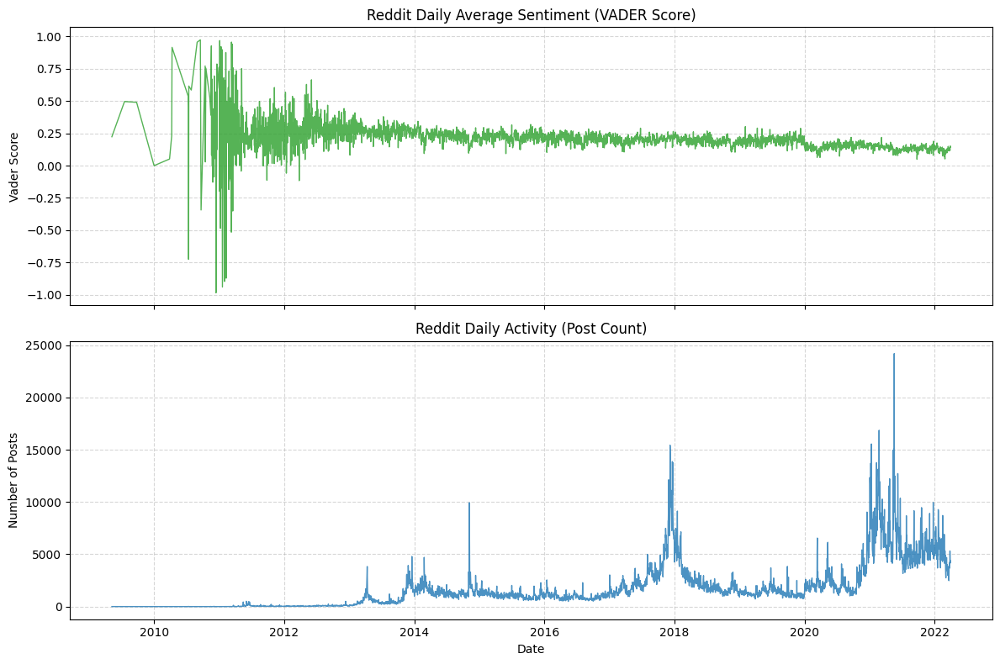

Additionally, we find in the sample period (2020.01 - 2022.04), only few days' average sentiment is negative. This does not mean that our statistical and sentiment analysis methods are incorrect. Rather, it is because the participants in this community are themselves holders of Bitcoin. If the market is sluggish, our overall score can indeed promptly reflect the changes in investor sentiment. For instance, from the end of 2021 to the beginning of 2022, as Bitcoin plummeted from its peak of $69,000, the VADER sentiment score showed a significant downward trend.

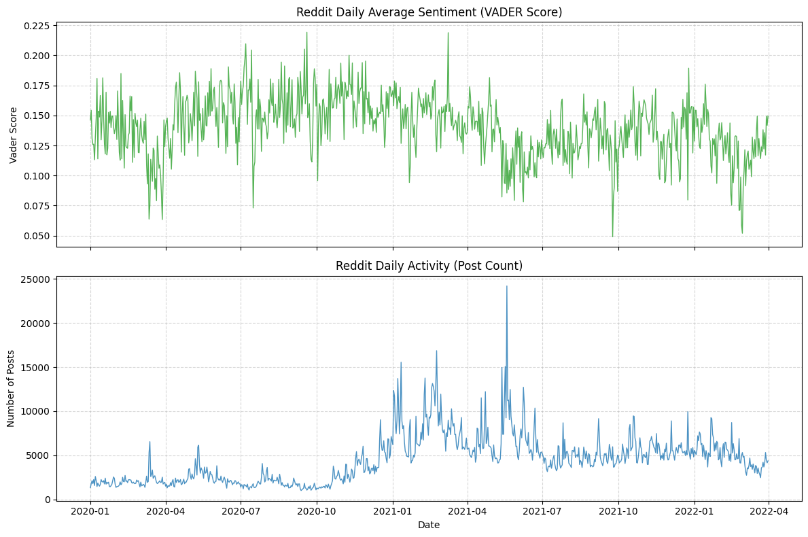

# Model Construction

## Linear Regression Model

### Linear Model Introduction
The regression formula is shown below:

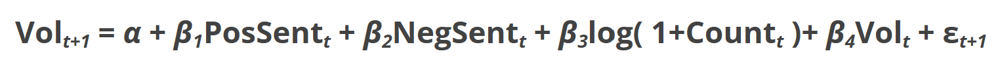

Since we aimed to examine the different effects of positive and negative sentiment, we split the sentiment score into two parts. When the score was positive, we defined it as positive sentiment and used its value directly. When the score was negative, we defined it as negative sentiment and used its absolute value. 

For the variable count, it is the number of news or comments, which represent the market attention for Bitcoin. We also take the logarithm of the count variable as log (1 + count) to reduce the impact of extreme values. 

Today’s volatility is included as a lagged variable because we believe it has a strong effect on the next day’s volatility due to the volatility clustering phenomenon observed in financial markets.

Lagged volatility captures the persistence of market uncertainty, while attention controls for the overall level of information flow, both of which are crucial for isolating the effect of sentiment on volatility.

To examine the different effects of sentiment from news and social media comments, we ran two regressions: one using comments from Reddit and the other using news from Google News. During both regressions, we used VADER to score the sentiment of the text to ensure that the scoring standard is consistent. The code and result for the regression are shown below.

### Linear Regression for The Sentiment Scores From Reddit

The code is divided into three parts. The first part is data preprocessing. In this part, we merge the sentiment data with the Bitcoin data and create two new columns: log (1 + count) and next-day volatility.
```python
# Merge by date
df_merged = pd.merge(
    df_volatility[["date", "Log_return", "Daily_volatility_log"]],
    df_score[["date", "vader_score", "post_count"]],
    on="date",
    how="left"
)

# Next-day volatility as target (t+1)
# shift(-1) moves tomorrow's volatility up to today's row
df_merged["Daily_volatility_log_t1"] = df_merged["Daily_volatility_log"].shift(-1)

# Keep rows used for regression
cols_used = [
    "Daily_volatility_log",
    "Daily_volatility_log_t1",
    "vader_score",
    "post_count"
]
df_reg = df_merged.dropna(subset=cols_used).copy()

# Log-transform post count to reduce the impact of extreme values
df_reg["post_count_log"] = np.log1p(df_reg["post_count"])

# Split sentiment into positive and negative components
df_reg["sent_pos"] = df_reg["vader_score"].clip(lower=0)
df_reg["sent_neg"] = (-df_reg["vader_score"]).clip(lower=0)
```
The second part is using OLS and HAC to do regression:
```python
# Regression (OLS with HAC SE)
y = df_reg["Daily_volatility_log_t1"]
X = df_reg[["sent_pos", "sent_neg", "post_count_log", "Daily_volatility_log"]]
X = sm.add_constant(X)

model = sm.OLS(y, X).fit(
    cov_type="HAC",
    cov_kwds={"maxlags": 5}
)
print(model.summary())
```
The third part is to calculate RMSE:
```python
# Simple RMSE evaluation
rmse = np.sqrt(np.mean(model.resid ** 2))
print("In-sample RMSE:", rmse)

y_true = y
y_mean = np.repeat(y.mean(), len(y))

rmse_mean = np.sqrt(np.mean((y_true - y_mean) ** 2))
print("Mean benchmark RMSE:", rmse_mean)
```
The regression result is shown below:

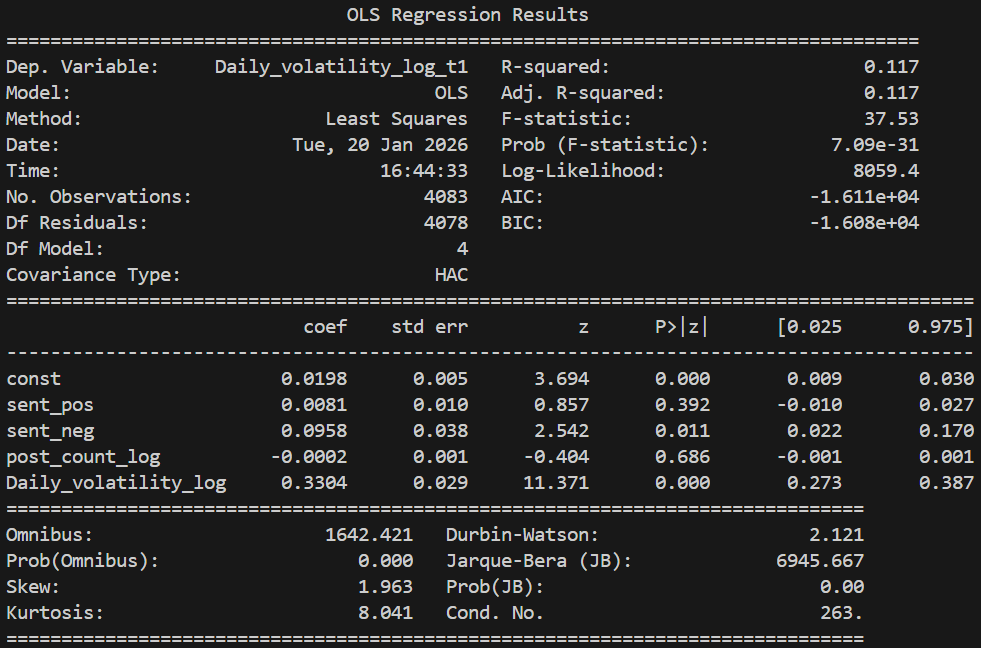

### Linear Regression for the sentiment score from Google News

The regression code for Google News is very similar to the previous one; therefore, we do not include it again. We only present the regression results below:

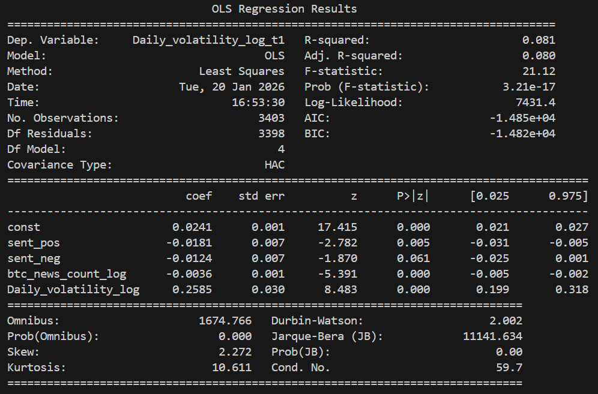

### Regression Results Analysis

According to the results, both regression models are statistically significant and explain approximately one-tenth of the variation in Bitcoin price volatility. Although the explanatory power seems not strong, it is reasonable due to the substantial noise in financial market volatility data. 

Regarding the relationship between the variables and volatility, the results show that the only consistently significant effect is the impact of current volatility on next-day volatility, reflecting the phenomenon of [volatility clustering](https://en.wikipedia.org/wiki/Volatility_clustering). This finding highlights the necessity of including lagged volatility in the regression model, as excluding it would result in biased estimates.

In terms of the relationship between sentiment and volatility, the results indicate that the effects differ between sentiment from comments and sentiment from news. Therefore, we believe that emotions do not simply affect volatility. The relationship between them is extremely complex and requires deeper research and analysis.

## Machine Learning Model - Random Forest

### Why Random Forest?

Firstly, there is one important question to answer before we start our discussion. Why do we choose the Random Forest for forecasting? Unlike linear models, it can capture nonlinear and interaction effects between lagged sentiment signals and Bitcoin volatility, which are likely to exist in sentiment-driven markets. Meanwhile, Random Forest acts relatively robust to noise in NLP-derived sentiment scores and is relatively stable under hyperparameter tuning. Moreover, it doesn’t impose a parametric structure on the data. All these valuable properties make Random Forest a great fit to be our first and baseline machine learning model for forecasting.

### Model Input

The sentiment input is a daily sentiment score derived from bitcoin-related news articles sourced from Google News processed through FinBERT as well as bitcoin-related Reddit news sourced from Kaggle processed through Vader. To capture delayed market reactions, we construct multiple lagged sentiment features as model predictors. These lagged terms are `sentiment_lag1`, `sentiment_lag3`, `sentiment_lag7`, which correspond to short-term, medium-term, and weekly sentiment effects. 

```python
df["sentiment_lag1"] = df["sentiment_score"].shift(1) 
df["sentiment_lag3"] = df["sentiment_score"].shift(3)
df["sentiment_lag7"] = df["sentiment_score"].shift(7)
```

Lagged volatility terms are greatly autocorrelated with current volatility. So in our analysis, we avoid using lagged volatility terms as predictors as including them would allow the model to achieve good predictive performance primarily through volatility clustering rather than the effects of sentiment scores. 

Therefore, based on the input dataset, we split our X and Y into:

```python
X = df_model[["sentiment_lag1", "sentiment_lag3", "sentiment_lag7"]] 
Y = df_model["volatility"]
```

### Model Training and Hyperparameter Finetuning

#### Train-Test Split

Instead of random sampling, the data is split chronologically. We utilize the first 80% of our data as the training dataset and the last 20% as the testing dataset. Dividing in chronological order mirrors real-world forecasting and prevents future information leakage.

```python 
split_idx = int(len(df_model) * 0.8) 
X_train = X.iloc[:split_idx] 
Y_train = Y.iloc[:split_idx] 
X_test = X.iloc[split_idx:] 
Y_test = Y.iloc[split_idx:]
```

#### Regressor Establishment

##### Initial Establishment

Initially, to achieve higher predicting efficiency, we set the values of hyperparameters relatively high. For example, in the initial implementation below, the number of trees - ‘n_estimators’ - is set to be 800 and the maximum depth of each tree - ‘max_depth’ - is set to be 3, which are proved to be too high after finetuning.

```python
initial_random_forest_model = RandomForestRegressor( 
n_estimators = 800, 
max_depth = 7, 
min_samples_leaf = 30, 
random_state = 42, 
n_jobs = -1, 
max_features = 1.0 
)
```

##### Hyperparameter Finetuning

To improve generalization, hyperparameters are optimized using randomized search with time-series cross-validation. We perform cross-validation analysis on different hyperparameter sets in order to find the optimal one. 

```python
tscv = TimeSeriesSplit(n_splits=5)

rf = RandomForestRegressor(
    random_state=42,
    n_jobs=-1
)

param_dist = {
    "n_estimators": [300, 500, 800, 1000],
    "max_depth": [3, 4, 5, 6, 7, None],
    "min_samples_leaf": [5, 10, 20, 30],
    "max_features": ["sqrt", 0.5, 1.0]
}

random_search = RandomizedSearchCV(
    estimator=rf,
    param_distributions=param_dist,
    n_iter=20,  
    cv=tscv,
    scoring="neg_root_mean_squared_error",
    random_state=42,
    n_jobs=-1,
    verbose=2
)

random_search.fit(X, Y)
```

##### Optimal Random Forest Regressor

After finetuning, we've discovered the optimal hyperparameter set to construct our random forest regressor, which is:

```python
optimal_random_forest_model = RandomForestRegressor( 
n_estimators = 500, 
max_depth = 3, 
min_samples_leaf = 20, 
random_state = 42, 
n_jobs = -1, 
max_features = "sqrt" 
)
```

### Model Evaluation

#### Performance Metrics

Our fine-tuned random forest regressor yields a RMSE of 0.0287449, which is lower than that of linear model. This result indicates that the random forest model better captures the non-linear patterns of the relationship between the sentiment scores and price volatility.

#### Performance Visualization

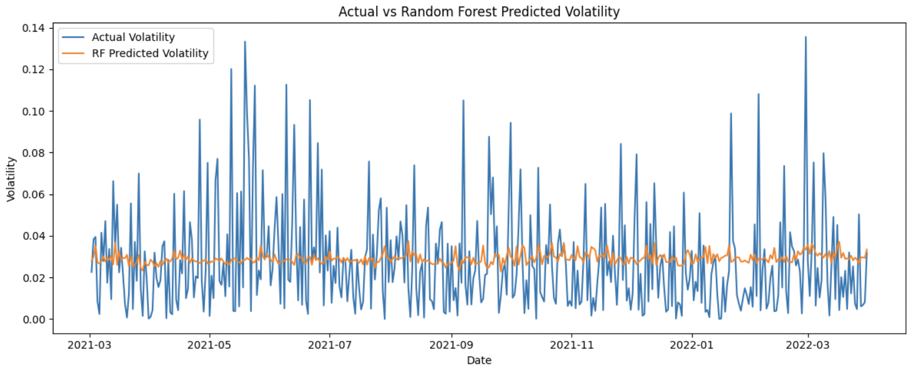

According to the plot above, the Random Forest model learns a stable, sentiment-driven volatility baseline following the trend of volatility change. However, it systematically fails to capture sharp volatility spikes, indicating that sentiment alone explains gradual regime variation rather than extreme market shocks.

## Machine Learning Model - Rolling-Window XGBoost

### Why Rolling-Window XGBoost?

- **Rolling-Window**: Strictly prevents look-ahead bias by retraining the model daily on a fixed recent historical period, simulates real trading, and focuses on short-term volatility clustering — essential for financial time-series forecasting.
- **XGBoost**: Offers superior accuracy, faster training, built-in regularization, and excellent handling of non-linear patterns and noisy data compared to alternatives like Random Forest or traditional models.

### Model Input

Our model is built on daily Bitcoin data, where the realized volatility serves as the target variable and the date is used to align observations chronologically. In addition to volatility, we also incorporate several auxiliary variables, including Bitcoin price, Reddit-based sentiment scores measured through Vader, Reddit post counts, and sentiment scores derived from news articles. Moreover, to capture delayed market reactions and short-term sentiment persistence, we construct multiple lagged features for both realized volatility and sentiment scores, using one-day, three-day, and seven-day lags. They are `realized_vol_lag1/3/7` and `vader_score_lag1/3/7` respectively. When enabled, a log transformation `np.log1p(realized_vol)` is applied for target and lagged terms. After generating all lagged features, observations with missing values caused by shifting are removed to ensure a clean and consistent input dataset for model training.

### Model Training

- **Core Logic** (`fit_predict` method):
  - For each day `i` from `window_size` to end of data:
    - **Train set**: Past `window_size` days (`df.iloc[i - window_size : i]`).
    - **Test set**: Current day (`df.iloc[i : i+1]`).
  - Train a **new XGBoost model** on the train set every day.
  - Predict the current day's realized volatility using the day's features.
- **No future leakage**: Test day data is never used in training.

```python
    def fit_predict(self,df):
        if "date" not in df.columns:
            raise ValueError(
                "The input DataFrame must contain a column named 'date'. "
            "This column is required for sorting and recording prediction dates."
        )
        # date must be datetime type
        if not pd.api.types.is_datetime64_any_dtype(df["date"]):
            raise TypeError(
            "The 'date' column must be of datetime type. "
            "Please convert it using pd.to_datetime() or parse_dates when reading the file."
        )
        # Date must 
        df = df.sort_values("date").reset_index(drop=True)
        
        for i in tqdm(range(self.window_size,len(df)),
                      desc = 'Training rolling windows',
                      unit = 'window'):
            train_df = df.iloc[i - self.window_size:i]
            test_df = df.iloc[i:i+1]
            
            X_train = train_df[self.feature_cols]
            y_train = train_df[self.target_col]
            
            X_test = test_df[self.feature_cols]
            y_test = test_df[self.target_col].values[0]
            
            model = self._build_model()
            model.fit(X_train,y_train)
            
            y_pred = model.predict(X_test)[0]
            
            self.predictions_.append(y_pred)
            self.actuals_.append(y_test)
            self.dates_.append(test_df['date'].values[0])
            self.models_.append(model)
        
        return self.results() #we use results function
```

### Model Finetuning

During the finetuning process, we have tried different sets of hyperparameters. After several hyperparameter adjustments, our optimal setting for the rolling-window XGBoost approach is achieved.

| Parameter             | Value  | Description / Purpose                                                                 |
|-----------------------|--------|---------------------------------------------------------------------------------------|
| `n_estimators`        | 800    | Number of boosting trees (weak learners) – high count for strong ensemble power      |
| `max_depth`           | 3      | Maximum depth of each tree – shallow to prevent overfitting and keep model simple    |
| `learning_rate`       | 0.05   | Step size (shrinkage) – small value for slow, stable learning and better generalization |
| `subsample`           | 0.8    | Fraction of training samples used per tree – 80% random subsampling reduces overfitting |
| `colsample_bytree`    | 0.8    | Fraction of features used per tree – 80% random feature sampling adds diversity      |
| `random_state`        | 42     | Fixed random seed – ensures reproducibility across runs                               |
| `objective`           | "reg:squarederror" | Loss function – mean squared error for regression task (volatility prediction)      |

For comparison, we also defined a class that does not use the rolling window: `StaticXGBoostVolatility`.

### Model Evaluation

#### Best Model Configuration

- **Inputs**: Average VADER-score of Reddit comments + Historical Volatility (lagged features: t-1, t-3, t-7)  
- **Window Size**: 30 days  
- **XGBoost Parameters**:  
  - n_estimators: 800  
  - max_depth: 3  
  - learning_rate: 0.05  
  - subsample: 0.8  
  - colsample_bytree: 0.8  
  - random_state: 42  
  - objective: reg:squarederror 
  
#### Performance Visualization

As shown in this plot, the 30-day rolling-window XGBoost predictions closely follow the overall evolution of realized volatility. While the model still underestimates the magnitude of extreme volatility spikes, it consistently identifies the timing and direction of volatility rises. Compared to the performance of our best Random Forest Model, the XGBoost Model outperforms by better capturing short-term volatility dynamics and adapting to changing market regimes. XGBoost’s boosting structure enables it to learn more complex, nonlinear relationships between sentiment and volatility. Therefore, although both models struggle to some extent when it comes to predict extreme magnitudes, XGBoost provides more informative and timely volatility forecasts than the Random Forest baseline.

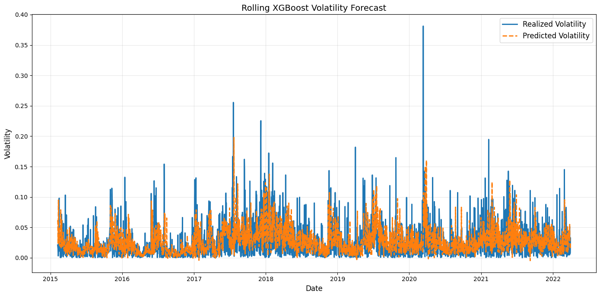
  
#### Performance Metrics  

For our optimal rolling-window XGBoost, we observe a RMSE value of 0.0317 while a R-squared value of -0.187141. With a RMSE lower than that of the linear model, the optimal rolling-window XGBoost does do a better job capturing the patterns of relationship between sentiment scores and price volatility. Moreover, a negative R-squared value is reasonable as the model severely underestimate the magnitude of volatility on a few extreme days. While the direction, timing, and peak positions match well, the large absolute errors on rare high-volatility events outweigh the good fit on normal days, making the model perform worse than a simple mean prediction in terms of explained variance.

#### Summarization

Due to the existence of several extreme outliers, it is particularly challenging to predict the exact magnitude of extreme Bitcoin volatility. Nevertheless, the model demonstrates a strong ability to identify when volatility is likely to rise sharply, exhibiting good directional and timing performance even when absolute errors are large. Besides, as reflected in our SHAP analysis below, a pronounced self-correlation in volatility is revealed, which closely aligns with that discovered in previous Random Forest Model. When added together as predictors, lagged historical volatility terms exhibit dominant effects in forecasting while lagged sentiment terms only contribute limited additional predictive information. In particular, three-day sentiment measures computed within a 30-day rolling window provide meaningful signals, although their overall contribution remains secondary compared to historical volatility. Moreover, negative sentiment appears to play a more influential role than positive sentiment, as reflected by its stronger impact in the SHAP value distributions.

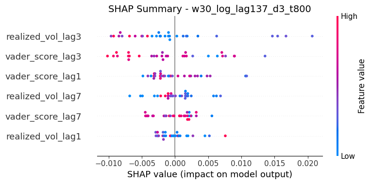

## Machine Learning Model - Insights in Trading Strategy

This section records a small but important surprise we have encountered during the research process. Going in, our prior is straightforward: "Once standard technical indicators are introduced, NLP sentiment should become redundant. Technical indicators are direct functions of price and volume, while sentiment is noisy, indirect, and delayed. If anything absorbs information, it should be technicals."

### So Technicals Will Dominate The Sentiment? Is That Really The Case?

The answer is actually **no**. 

We first built a **strictly symmetric pipeline** for both feature families. NLP sentiment and technical indicators went through the exact same preprocessing steps: heteroskedasticity testing, unit root testing, transformations where required, identical train–CV–test splits, and the same XGBoost regression framework with the same optimization objective. This matters because it removes the most common explanation for performance gaps: inconsistent treatment.

Using **technical indicators** only, the strategy already performed well. Excess return versus buy-and-hold was around 109%, performance was stable across cross-validation folds, and the equity curve was economically interpretable. At this point, the framework was already viable on its own.

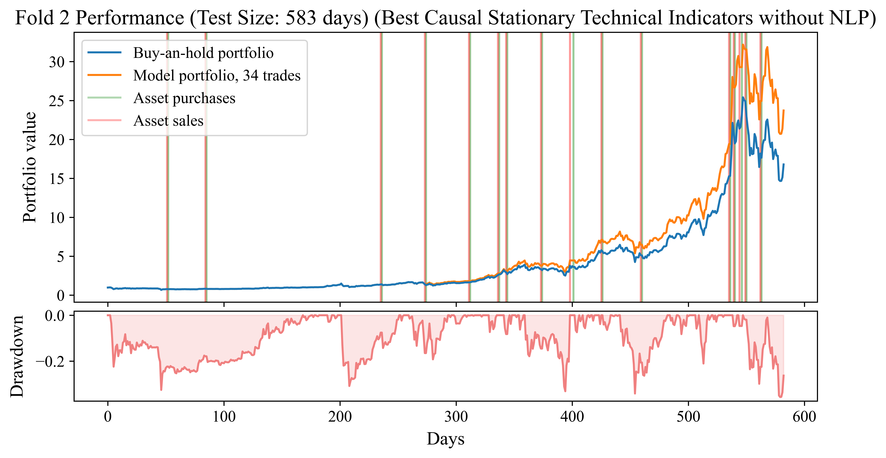

The real surprise came when **NLP sentiment was added on top of technical indicators**. Excess return jumped to over 215%, more than doubling relative to the technical-only model. The improvement was not driven by a single lucky fold or regime; it appeared consistently across validation splits.

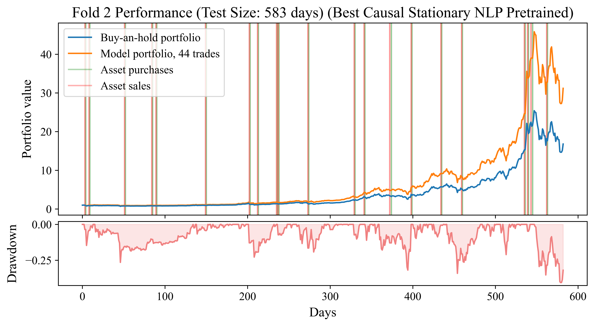

A natural concern is that this uplift is just feature proliferation. To check this, we examined the correlation structure between NLP features and technical indicators. The result was reassuring: correlations were generally low, suggesting that sentiment contributes information that is largely orthogonal to price-based signals.

What ultimately convinced me was stability. Fold-level performance curves showed similar shapes and drawdown behavior, with no single period dominating returns. This makes it difficult to dismiss the result as overfitting or leakage.

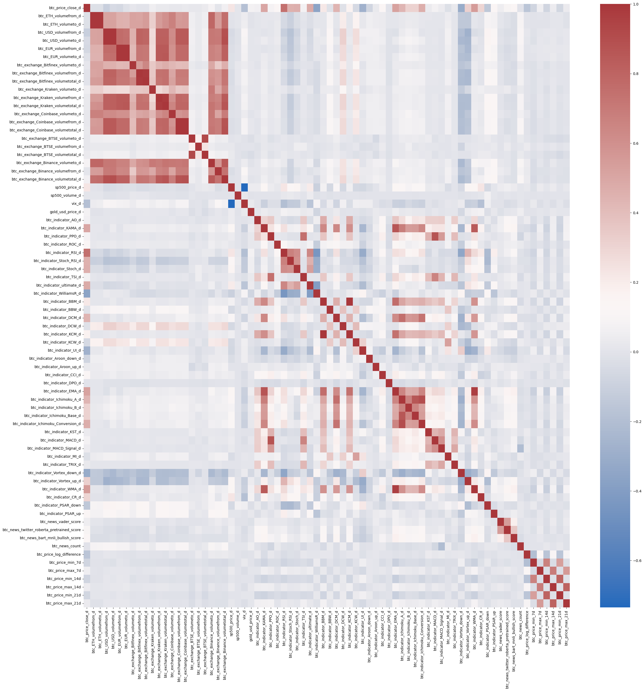

The takeaway is simple. Technical indicators provide a strong baseline, but they do not subsume sentiment. Instead, sentiment becomes more valuable once technical structure is accounted for. One summarizes **what the market has done**; the other reflects **how the market talks about it.**

**Technical indicators didn’t kill sentiment — they made its value visible.**
