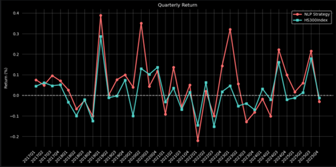
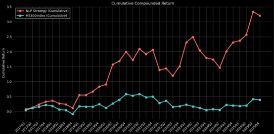
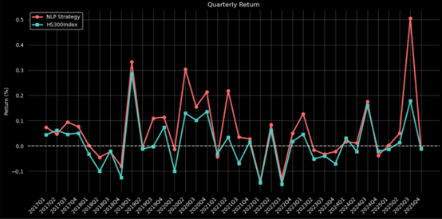
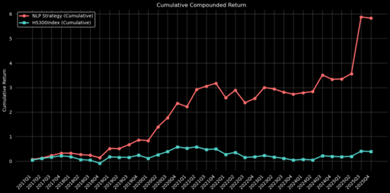

By Group "Text Trader"

# From Sentiment Analysis to Quantitative Backtesting

At the intersection of finance and natural language processing, we have completed an end-to-end project that spans from text sentiment analysis to quantitative investment strategies. The previous blog post described the steps and methods we implemented for automated text collection and pre-processing. This blog reflects on our iterative process, the technical hurdles we cleared, and the journey of transforming unstructured financial narratives into actionable trading strategies.

## I. Sentiment Analysis Pipeline

### 1. Model Selection: The Efficiency-Accuracy Frontier

Choosing the "brain" for our sentiment engine was not a matter of trial and error, but a strategic decision informed by recent literature in financial NLP. We evaluated our options by balancing linguistic depth against computational feasibility, specifically referencing the comparative frameworks provided by **Mahendran et al. (2025)** and **Neshaei et al. (2024)**.

We considered 3 options: Distilbert-ss, FinBERT and Bert-large. According to _Mahendran et al._, while **FinBERT** remains a specialized benchmark for Financial Sentiment Analysis (FSA), the integration of lighter transformer architectures often provides a more agile framework for large-scale data indexing. Furthermore, the research by _Neshaei et al._ on the robustness of transformer-based classifiers highlighted that smaller, optimized models like **DistilBERT** can maintain high performance while significantly reducing the "computational tax" during the encoding phase.

Following is our summary of model performances in 3 aspects:

| Model | Understanding for financial items | Capture text | Computing efficiency |
|:------:|:-------------:|:-------------:|:----------:|
| Distilbert-sst | medium | good | excellent |
| Finbert | excellent | excellent | medium |
| Bert-large | excellent | excellent | bad |

Ultimately, the **Distilbert-sst** model was selected as the primary model due to its optimal balance between speed and accuracy.


### 2.Overcoming the "Token Limit" Wall

Even with a robust model selected, we immediately encountered a physical constraint common in NLP: *512-token limit*. The model’s truncation of texts exceeding 512 tokens led to partial information loss, resulting in certain inaccuracies in sentiment analysis. Ultimately. We adopted a **chunking approach**, dividing the text into segments of 500 characters each, and then aggregating the sentiment outcomes. By segmenting the reports into 500-character blocks, we ensured our sentiment score reflected the entire document's tone.

```Python
def sentiment_analysis(text, sentiment_analyzer):
    text = preprocess_text(text)
    results = []
    try:
        # Breaking long narratives into 500-char chunks to bypass the 512-token limit
        chunks = [text[i:i + 500] for i in range(0, len(text), 500)]
        for chunk in chunks:
            if len(chunk.strip()) > 10:
                result = sentiment_analyzer(chunk[:500], truncation=True)[0]
                results.append(result)
    except Exception as e:
        print(f"Sentiment analysis error: {e}")
    return results
```

## II. Weight Construction: Mapping Sentiment Scores to Portfolio Weights

The next task is to construct the portfolio weight. The transition from a sentiment score to a tangible portfolio position is perhaps the most delicate stage of our pipeline. Our primary challenge was the Weight Mapping Problem: how do you convert fluctuating emotional signals into investment weights without sudden and drastic changes.

In our early brainstorming, we considered a "static" approach where weights were determined solely by the current quarter’s sentiment scores. However, we quickly realized this would lead to erratic shifts in individual stock positions.

To solve this, we adopted an **Iterative Weight-Tilting Strategy**. Instead of rebuilding the portfolio from scratch each quarter, we adjust the existing weights based on the sentiment scores of the current period. This recursive approach ensures that the portfolio evolves organically, maintaining continuity with the previous period’s allocation while dynamically absorbing new linguistic information.


$$weight_i = weight_{i-1} \times weight\_change$$


But here comes the new problem. If the simplest weight adjustment formula were adopted:


$$ weight\_change = positive\_score - negative\_score $$


It still leads to the issue of excessive weight adjustment, causing the portfolio weight of a particular stock to fluctuate too drastically within a single quarter.

To address this, after obtaining the positive and negative sentiment scores for each stock, we employed a refined weight adjustment formula:

$${weight_change} = ({positive_score} - {negative_score}) × {avg_confidence}$$


This formula allows for a greater adjustment magnitude when sentiment is strong and the model's confidence is high.


```python
for i in range(len(code_list)):
        total = pos_values[i] + neg_values[i]
        if number_list[i] == 0 or total == 0:
            pos_score = 0
            neg_score = 0
            avg_conf = 0
        else:
            # the pos_score represents the fraction of confidence sum of positive label over the whole confidence sum of a company
            pos_score = pos_values[i] / total 
            neg_score = 1 - pos_score
            # avg_conf represents the average confidence of output
            avg_conf = confidence_sums[i] / number_list[i]

        combine_list.append((
            code_list[i],
            name_list[i],
            pos_score,
            neg_score,
            avg_conf
        ))
```

Subsequently, we applied normalization to these adjustments, resulting in more stable weight changes that better align with investment logic.

```python
 # compute the portfolio weights in quarterly order
    for quarter in sorted(df['quarter'].unique()):
        quarter_df = df[df['quarter'] == quarter]

        # update portfolio weights
        updated_weights = {}
        for _, row in quarter_df.iterrows():
            stock = row['stock']
            name = row['name']
            wc = row['weight_change']

            updated_weights[stock] = weights[stock] * (1 + wc)

        # normalization: the total weights of the constituent companies should add up to 1
        total = sum(updated_weights.values())
        for _, row in quarter_df.iterrows():
            stock = row['stock']
            name = row['name']
            wc = row['weight_change']
            new_weight = updated_weights[stock] / total

            results.append([quarter, stock, name, wc, new_weight])
```

## III. Backtesting Framework Design

Writing the backtesting engine taught us that data is rarely "ready-to-use." We faced a temporal mismatch: sentiment data arrives quarterly (with the reports), but prices move daily.

We had to design a resampler that compounded daily returns into quarterly buckets to match our rebalancing frequency. 

```python
# use resample function to change daily data to quarterly data
q_data = re_data.resample('Q').apply(lambda x: ((1 + x/100).prod() - 1)*100)
q_data.index = q_data.index.to_period('Q')
q_data.rename_axis('quarter', axis=0, inplace=True)
```


Based on the aforementioned sentiment analysis and weight calculations, the weighted return of the investment portfolio is calculated for each quarter.


$$quarterly\_returns_{t} = \sum_{i=1}^{300} stock\_weight_{i} \times stock\_return_{i}$$


```python
def backtest(return_data, quarter_weights):
    return quarter_weights.groupby(by='quarter').apply(lambda x:compute_weighted_return(return_data, x))


def compute_weighted_return(return_data, group):
    quarter = group.name
    data = return_data.loc[return_data['quarter'] == quarter, :]
    data.drop('quarter', axis=1, inplace=True)
    group.set_index('stock', inplace=True)
    return (group['weight'] * data).sum(axis=1)
```

## IV. Comparison of Different Backtesting Frameworks

We designed two distinct backtesting frameworks: a Sentiment analysis-based weight adjustment strategy and an End-to-End BERT regression strategy.

The primary difference between the two backtesting designs lies in their methodological approaches. The first strategy begins with sentiment analysis, then converts sentiment scores into weight adjustments, reflecting the intrinsic logic of behavioral finance—where emotions influence investment behavior and, consequently, prices. The second strategy directly maps textual information to stock returns and adjusts weights based on predicted returns, aligning with the efficient market hypothesis, which posits that information determines prices.

**Backtesting results based on Sentiment-analysis Bert Model:**

<div align="center">
    
    <br>
    <span style="font-size: 0.9em; color: #666; font-style: italic;">
        Figure1：Quarterly Return of NLP Strategy
    </span>
</div>

<div align="center">
    
    <br>
    <span style="font-size: 0.9em; color: #666; font-style: italic;">
        Figure2：Cumulative Return of NLP Strategy
    </span>
</div><br>


**Backtesting results based on End-to-End Bert model:**
<div align="center">
    
    <br>
    <span style="font-size: 0.9em; color: #666; font-style: italic;">
        Figure3：Quarterly Return of End-to-End Bert Strategy
    </span>
</div>

<div align="center">
    
    <br>
    <span style="font-size: 0.9em; color: #666; font-style: italic;">
        Figure4：Cumulative Return of End-to-End Bert Strategy
    </span>
</div><br>


**Investment performance of the 2 models:**


| Model | Sentiment-analysis Bert Model | End-to-End Bert model | Increase(compared with sentiment base bert model) |
|:--------------:|:----------------------:|:----------------:|:-----------------------------------:|
| Sharpe Ratio | 0.3648 | 0.4743 | 30.0164% |
| Information Rario | 0.4456 | 0.7332 | 64.5422% |
| Absolute return | 320.63% | 582.87% | 81.7889% |
<div style="height: 30px;"></div> 
**key insight:**  
As can be seen from the table, the backtesting results of the End-to-End BERT regression model are significantly better than those of the sentiment analysis-based BERT model. We believe the main reasons for this are: 
 
1. Sentiment analysis only extracts emotional information, whereas the End-to-end model can extract additional information beyond sentiment (such as risks, opportunities, etc.).  

2. The end-to-end model achieves a direct mapping from text to investment returns, which provides a clearer objective.  


## V. Future Direction

Currently, our team is still in the exploratory phase. Our future direction is to **implement multi-task learning**, combining the two different backtesting strategies to conduct investment predictions based on factors such as **sentiment, risk, and future opportunities** simultaneously.